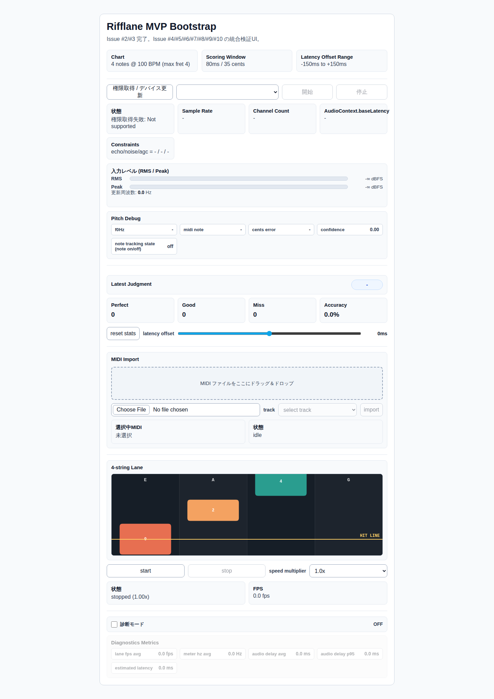
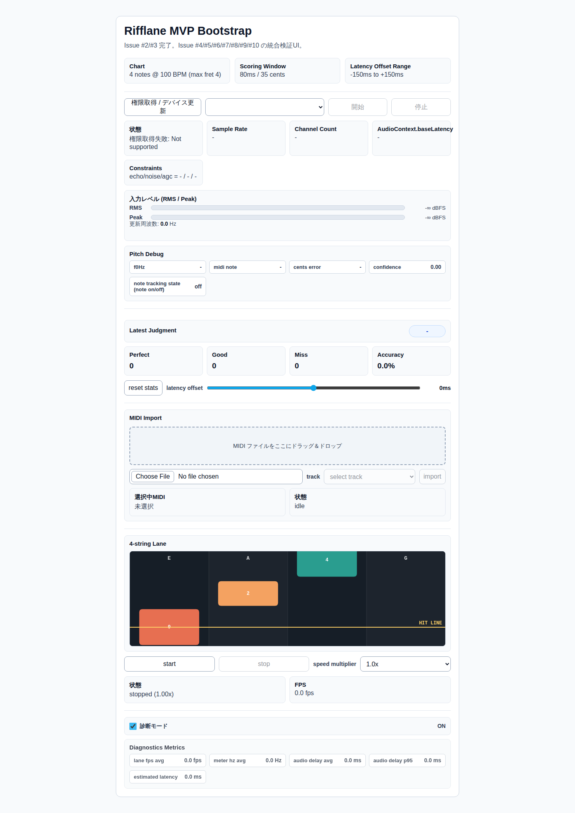
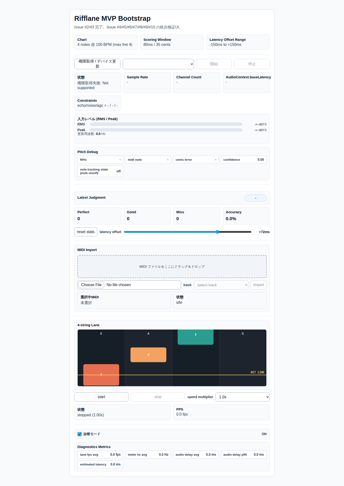
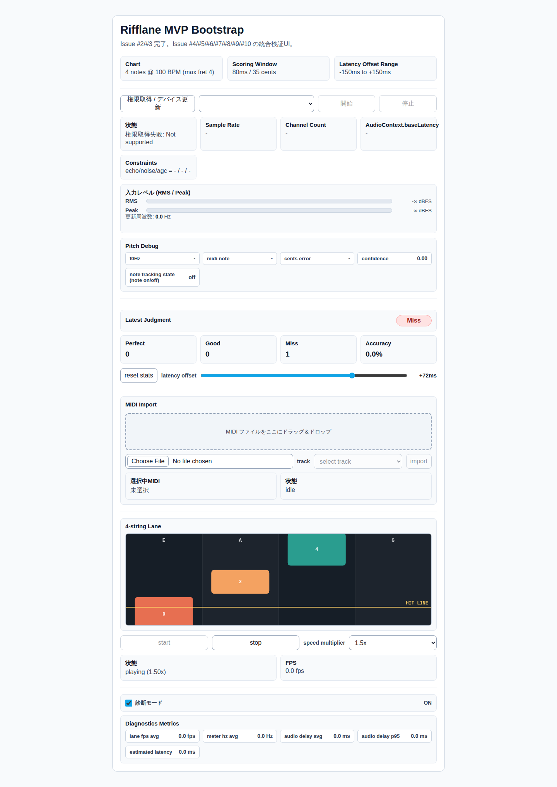

# テストガイド

本書は Rifflane のテスト方針と実行手順を定義します。前提は Node.js `20.x`、npm、Playwright Chromium 実行環境です。

## テスト戦略

### Unit test（`vitest`）

- 目的: ドメインロジックの正確性を高速に検証する。
- 対象:
  - `src/scoring/engine.test.ts`: 判定（`Perfect/Good/Miss`）、latency offset、auto-miss、lane filter、setChart/reset。
  - `src/scoring/config.test.ts`: 判定窓パラメータの境界値と異常値。
  - `src/scoring/pitch.test.ts`: 開放弦定義解決、midi/cents 変換の異常値。
  - `src/scoring/adapters.test.ts`: chart/lane-scroller 変換の正常系と入力異常系。
  - `src/scoring/latency-offset-storage.test.ts`: localStorage 読み書き・例外時フォールバック。
  - `src/chart/midi.test.ts`: SMF parse、トラック変換、エラーコード（`SMF_PARSE_FAILED`、`TRACK_NOT_FOUND`、`NOTE_OUT_OF_RANGE` など）。

### E2E test（`playwright`）

- 目的: UI の主要導線と状態遷移の退行を検知する。
- 対象（`tests/e2e/app.spec.ts`）:
  - 初期表示（主要パネル表示）
  - diagnostics mode トグル反映
  - lane `start/stop` と速度変更
  - latency offset slider 反映
  - diagnostics / latency offset の localStorage 永続化（reload 復元）

### Manual test（実機/ブラウザ）

- 目的: マイク権限、実オーディオ入力、端末差分など自動化しにくい領域を補完する。
- 対象:
  - `getUserMedia` 権限取得、デバイス選択
  - AudioWorklet ベースのメーター/Pitch 更新
  - MIDI import と採点フロー（演奏入力時の判定更新）
  - Windows/WSL2/Android（`adb reverse`）での疎通

## 主要シナリオ

| 区分 | シナリオ | 期待結果 |
| --- | --- | --- |
| Unit | 採点判定窓（perfect/good/miss） | 判定と統計（accuracy 含む）が仕様どおり更新される |
| Unit | storage/config/adapters の境界値検証 | 設定・保存・変換ロジックが異常入力で安全に失敗する |
| Unit | MIDI parse/変換と異常系 | 正常系は lane/fret へ変換、異常系は規定エラーコードを返す |
| E2E | 画面初期表示と主要UI存在確認 | 主要パネルが表示され、初期状態が崩れていない |
| E2E | lane 操作・速度変更・slider操作 | UI状態と表示値が入力操作に追従する |
| Manual | マイク入力から採点までの一連動作 | RMS/Pitch/判定表示が連動し、操作可能状態を維持する |

## ローカル実行手順

1. 依存関係をインストールする。`npm ci`
2. 静的検証を実行する。`npm run lint && npm run typecheck`
3. Unit test を実行する。`npm run test:unit`
4. Unit coverage を実行する。`npm run test:unit:coverage`
5. E2E test を実行する。`npm run test:e2e`
6. ビルド検証を実行する。`npm run build`

補足:

- Playwright 初回実行時はブラウザ導入が必要な場合があります。`npx playwright install --with-deps chromium`
- E2E は `playwright.config.ts` でローカル Web サーバ（`127.0.0.1:4173`）を自動起動します。
- E2E 結果スクリーンショットは `npm run capture:e2e-screenshots` で生成できます。
- Unit coverage レポートは `coverage/`（HTML: `coverage/index.html`）に出力されます。

Coverage スナップショット（2026-02-21）:
- `npm run test:unit:coverage`
- 全体: `Statements 94.93% / Branches 85.03% / Functions 94.79% / Lines 95.01%`
- 補足: 防御的分岐（例: 不正MIDI値、到達困難なガード分岐）は一部未到達。

## E2E結果スクリーンショット

生成コマンド:

```bash
npm run capture:e2e-screenshots
```






## CI対応

- CI 定義: `.github/workflows/ci.yml`
- 実行環境: `ubuntu-latest` + Node.js `20`
- ジョブ構成:
  - `verify`: `npm ci` -> `lint` -> `typecheck` -> `test:unit` -> `build`
  - `e2e`（`needs: verify`）: Playwright Chromium 導入後に `npm run test:e2e`
- E2E は CI では `retries=2`、`workers=1`（`playwright.config.ts`）で安定性を優先します。

## 既知ギャップ

- 実マイク入力・ブラウザ権限・OS依存挙動は自動テストで完全再現できないため、manual test が必須。
- E2E は現状 UI のベースライン確認中心で、MIDI 実データ投入から採点結果までの統合シナリオは未自動化。
- パフォーマンス指標（FPS、worklet 遅延、長時間安定性）の閾値判定は CI に未組み込み。
- デバイスマトリクス（Windows/WSL2/Android 実機差分）は継続的な手動回帰に依存。
